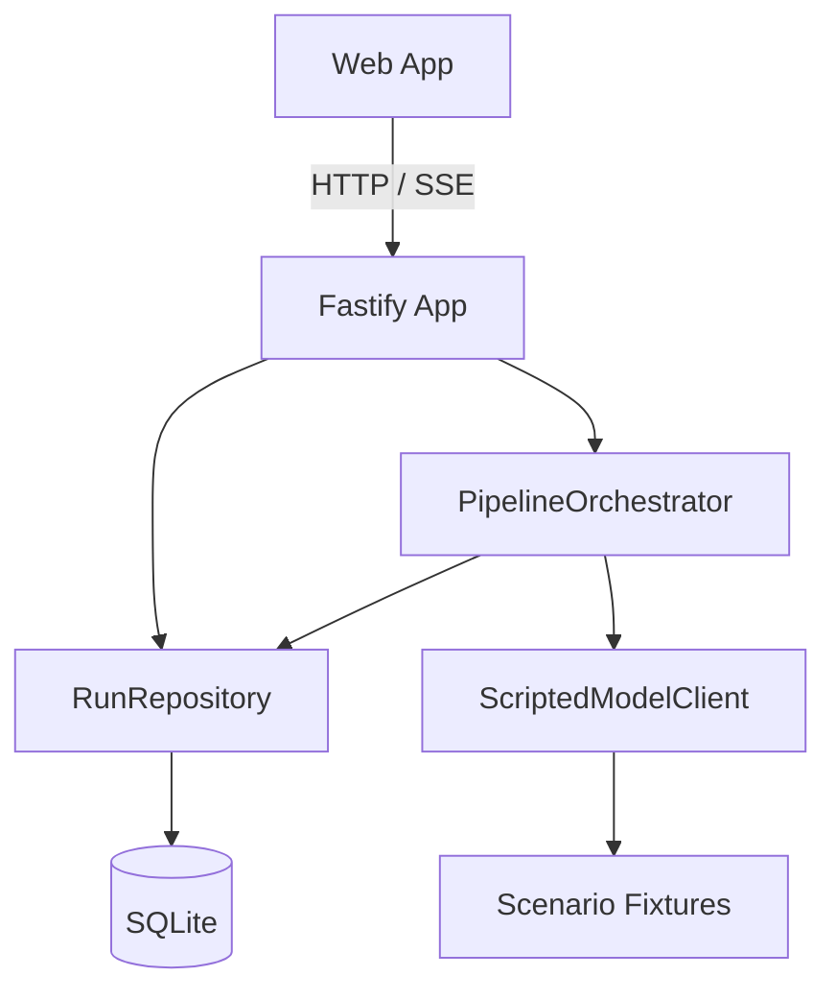
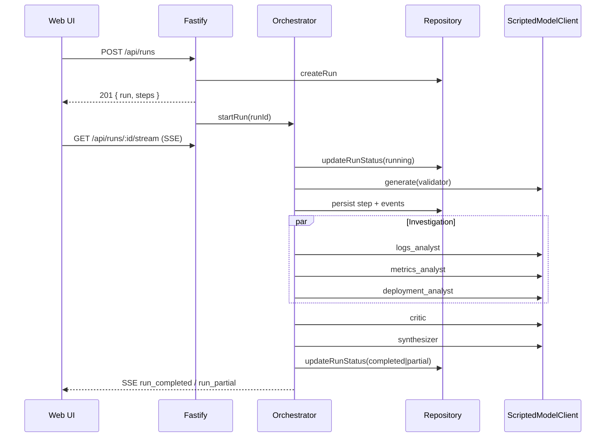

# OpsSwarm Architecture

Professional architecture reference for the OpsSwarm multi-agent incident-triage system. This document describes **what is implemented in the repository today**.

---

## High-Level Architecture

OpsSwarm is a pnpm monorepo with three packages:

| Package | Responsibility |
|---|---|
| `@opsswarm/shared` | Zod schemas, `ModelClient` interface, `ScriptedModelClient`, scenario fixtures |
| `@opsswarm/server` | Fastify HTTP/SSE API, SQLite persistence, pipeline orchestrator |
| `@opsswarm/web` | React investigation dashboard |

```text
┌─────────────────────────────────────────────────────────────┐
│                         Operator UI                          │
│              React + Vite (@opsswarm/web)                    │
│   Launch form · Pipeline graph · Timeline · Report           │
└───────────────────────────┬─────────────────────────────────┘
                            │ REST + SSE (/api/*)
┌───────────────────────────▼─────────────────────────────────┐
│                     Fastify API Layer                        │
│                   (@opsswarm/server app.ts)                  │
└───────────────────────────┬─────────────────────────────────┘
                            │
          ┌─────────────────┼─────────────────┐
          ▼                 ▼                 ▼
   RunRepository    PipelineOrchestrator   ScriptedModelClient
   (SQLite/Drizzle)  (state machine)       (deterministic)
          │                 │
          │                 ├── validate
          │                 ├── logs / metrics / deployment (parallel)
          │                 ├── critic
          │                 └── synthesizer
          ▼
     SQLite database (runs, steps, step_attempts, events)
```

---

## Component Diagram



---

## Folder Structure

```text
packages/
  shared/src/
    schemas.ts                 # Domain + API Zod schemas
    scripted-model-client.ts   # Deterministic ModelClient
    fixtures.ts                # Incidents + scripted responses
  server/src/
    index.ts                   # Process entry (PORT/HOST)
    app.ts                     # Routes, wiring, auto-resume
    orchestrator/pipeline.ts   # State machine
    db/
      client.ts                # better-sqlite3 + bootstrap DDL
      schema.ts                # Drizzle table definitions
      repository.ts            # Persistence API
  web/src/
    main.tsx
    App.tsx                    # Single-page UI
    api.ts                     # Fetch + EventSource client
    styles.css
  web/e2e/
    smoke.spec.ts
```

---

## Layered Architecture

| Layer | Location | Role |
|---|---|---|
| Presentation | `packages/web` | Scenario launch, live graph, timeline, outputs, report |
| API | `packages/server/src/app.ts` | REST + SSE; request validation via Zod |
| Orchestration | `packages/server/src/orchestrator/pipeline.ts` | Directed graph execution, retries, cancel, resume |
| Domain / contracts | `packages/shared` | Incident, agent I/O, events, `ModelClient` |
| Persistence | `packages/server/src/db/*` | Repository over SQLite |
| Model adapter | `ScriptedModelClient` | Fixture-backed generation |

There is **no separate service-layer package**. Business logic lives primarily in the orchestrator and repository. Route handlers are thin.

---

## Database Architecture

SQLite file database with WAL mode and foreign keys enabled.

Tables:

1. `runs` — incident payload, options, status, report, cancel flag, idempotency key
2. `steps` — one row per pipeline step per run
3. `step_attempts` — each try including repair calls
4. `events` — append-only audit / SSE timeline

Schema is applied at process start via `CREATE TABLE IF NOT EXISTS` in `client.ts`. Generated Drizzle migration files are **not present**; `pnpm db:migrate` currently points at a missing `migrate.ts`.

Full column reference: [docs/DatabaseDesign.md](./docs/DatabaseDesign.md)

---

## Repository Layer

`RunRepository` (`packages/server/src/db/repository.ts`) owns all SQL access:

- Create / get / list runs
- Idempotent create via unique `idempotency_key`
- Step CRUD + attempt lifecycle
- Event append / list
- Cancel request flag
- `listResumableRuns()` for restart recovery

Route handlers and the orchestrator never talk to SQLite directly.

---

## Service Layer

**Currently not implemented as a distinct layer.**

Orchestration and domain rules are concentrated in `PipelineOrchestrator`. If the codebase grows, extracting a `RunService` between routes and the orchestrator would be a natural next step (see Future Enhancements).

---

## API Layer

Fastify app with `@fastify/cors` (`origin: true`).

Endpoints (see [docs/APIDocumentation.md](./docs/APIDocumentation.md)):

- Health, scenarios, pipeline graph
- Run CRUD-ish: create, get, list, cancel
- Events list + SSE stream

`@fastify/static` is declared as a dependency but **not registered**; production static hosting is nginx in Docker Compose.

---

## Orchestrator

`PipelineOrchestrator` is an explicit directed-graph executor:

```text
validate
   │
   ├── logs_analyst ──┐
   ├── metrics_analyst├──► critic ──► synthesizer
   └── deployment_analyst ─┘
```

Capabilities:

| Concern | Implementation |
|---|---|
| Fan-out / fan-in | `mapPool` over investigation steps |
| Concurrency limit | `run.options.concurrencyLimit` (default 3) |
| Retries | `maxAttempts = maxRetries + 1`; exponential backoff |
| Timeouts | `withTimeout` around each model call |
| Cancellation | AbortController + persisted `cancel_requested` |
| Repair | One repair model call per attempt on invalid output |
| Partial success | Investigation failures continue to critic/synthesizer |
| Resume | Skip terminal steps; re-enter unfinished runs on boot |
| Events | Persist + emit for SSE subscribers |

---

## Agent Workflow

Each step maps to an `AgentRole` via `roleForStep`:

| Step | Role |
|---|---|
| `validate` | `validator` |
| `logs_analyst` | `logs_analyst` |
| `metrics_analyst` | `metrics_analyst` |
| `deployment_analyst` | `deployment_analyst` |
| `critic` | `critic` |
| `synthesizer` | `synthesizer` |

The model boundary is:

```ts
interface ModelClient {
  generate(request: ModelRequest): Promise<ModelResponse>;
}
```

Official runs inject `ScriptedModelClient`, keyed by `` `${scenarioId}:${role}` ``.

Agent details: [docs/AgentDocumentation.md](./docs/AgentDocumentation.md)

---

## State Machine

### Run statuses

`pending` → `running` → (`completed` | `partial` | `failed` | `cancelled`)

### Step statuses

`pending` → `running` → (`succeeded` | `failed` | `timed_out` | `cancelled`)

`skipped` exists in the Zod schema but is **not used** by the orchestrator.

### Transition rules (summary)

- Validator permanent failure → run `failed`
- Investigation permanent failure → continue; later run may be `partial`
- Critic failure → recorded in `failedAgents`; synthesizer still runs
- Synthesizer failure → run `failed`
- Cancel during execution → run `cancelled`
- Any investigation failures with successful synthesizer → run `partial`

---

## Sequence Diagram



---

## Data Flow

1. Operator selects a scenario in the UI (or client posts a `CreateRunRequest`)
2. API validates with Zod and persists a `runs` row + six `steps` rows
3. Orchestrator loads incident evidence IDs into a citation allow-list
4. Each agent returns JSON; orchestrator validates schema + evidence citations
5. Invalid output triggers one repair call with prior error context
6. Successful outputs are stored on `steps` / `step_attempts`
7. Synthesizer output becomes `runs.report_json`
8. Events are appended continuously and streamed to SSE clients

---

## Error Handling

| Failure class | Behavior |
|---|---|
| Invalid create payload | HTTP 400 with Zod flatten |
| Missing run / scenario | HTTP 404 |
| Transient model error (`retryable: true`) | Retry with backoff until max attempts |
| Permanent model error | Fail step; investigation → continue; validate/synth → may fail run |
| Invalid JSON / schema / bad citation | One repair attempt; then retryable attempt failure |
| Timeout | Step `timed_out`; treated as permanent for that step |
| Cancel | Abort in-flight waits; mark pending/running steps cancelled |

---

## Retry Strategy

- `maxRetries` option (default `2`) → `maxAttempts = maxRetries + 1`
- Backoff: `BACKOFF_BASE_MS * 2^(attempt - 2)` before retry attempts
- Default `BACKOFF_BASE_MS` in the app wiring: `25`
- Repair calls do **not** consume an extra outer attempt number; they are flagged `is_repair` on `step_attempts`
- Timed-out and cancelled attempts are not retried in the same path

---

## Logging Strategy

- Fastify logger enabled when `NODE_ENV !== 'test'`
- Pipeline audit trail is the **`events` table** (and SSE), not application log files
- There is **no structured log shipping**, log rotation config, or OpenTelemetry instrumentation in this codebase

---

## Concurrency Model

- Investigation steps execute via an in-process worker pool (`mapPool`)
- Limit configurable per run (`concurrencyLimit`, default `3`, max `10`)
- Single Node.js process; no distributed queue
- `running` Set prevents double-starting the same `runId` in-process
- Restart recovery re-enters unfinished runs; mid-flight model calls are not checkpointed mid-request

---

## Design Decisions

1. **Hand-rolled orchestrator** — avoids LangChain/LangGraph so resilience behavior is explicit and testable
2. **ScriptedModelClient** — keeps benchmark/tests deterministic; real providers can implement `ModelClient` later
3. **SQLite + repository** — sufficient for single-node durable execution and easy CI (`:memory:` or temp files)
4. **SSE over WebSockets** — one-way pipeline event stream; simpler than duplex sockets for this UI
5. **Evidence citation enforcement** — factual claims must reference known evidence IDs from the incident payload
6. **Partial success** — one failed analyst must not discard remaining investigation value
7. **Idempotency keys** — safe client retries on `POST /api/runs` without duplicate pipelines

---

## Related Documents

- [docs/Workflow.md](./docs/Workflow.md)
- [docs/DatabaseDesign.md](./docs/DatabaseDesign.md)
- [docs/APIDocumentation.md](./docs/APIDocumentation.md)
- [docs/AgentDocumentation.md](./docs/AgentDocumentation.md)
